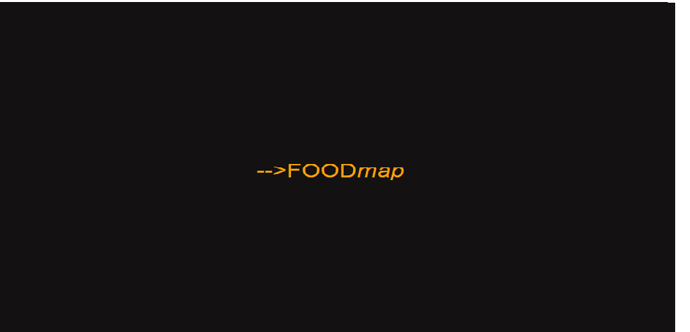
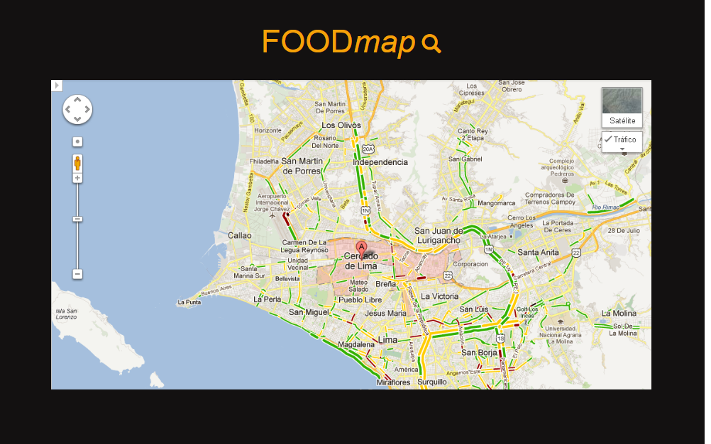
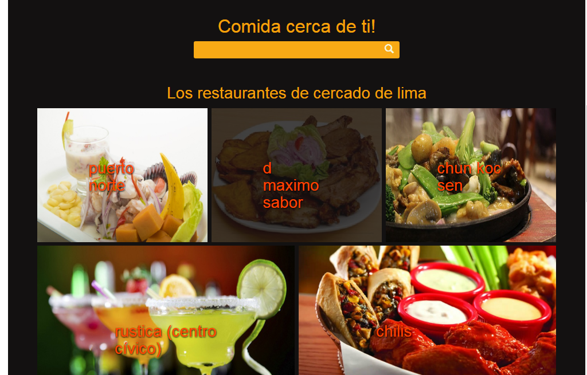
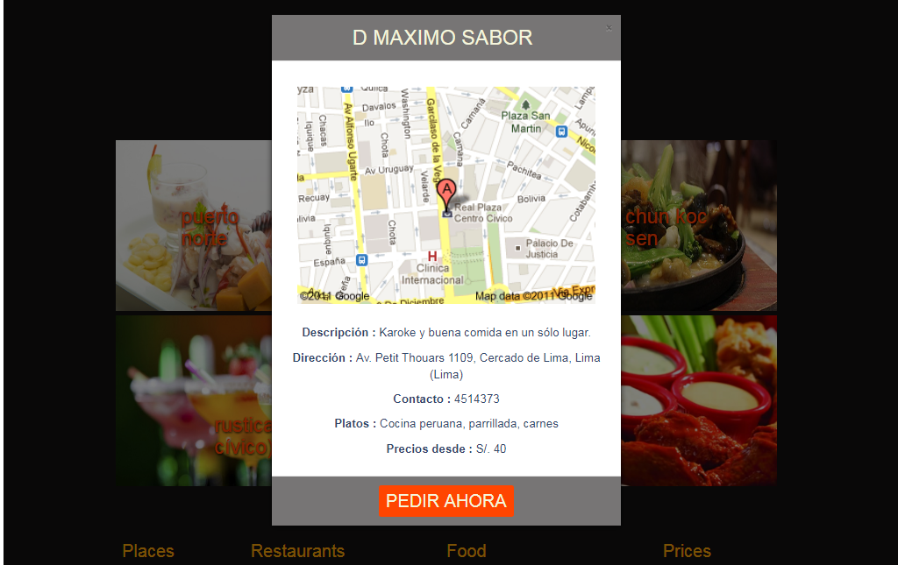

# Aplicación FoodMap

## Esta aplicacion  sirve para encontrar restaurantes cerca de donde te ubiques, solo tienes que agregar en el input el nombre del distrito(donde te ubicas) y enseguida tendras como resultado los nombres de los restaurantes y podras acceder a la informacion general de cada restaurante de ese distrito.

## Para este proyecto utilice los valores de la data del archivo data.js para poder mostrar en la pagina principal como resultado de la búsqueda,cada resultado depende del nombre de búsqueda que ingrese el usuario.

## El tipo de filtrado que podra realizar el usuario sera por nombre de distritos,por el momento solo 5 distritos : 

## breña,jesus maria,cercado de lima,pueblo libre y la victoria. 

## Dinamicamente se visualizaran resultados con el nombre e imagenes de platos que sirven en aquel restaurante.Al hacer click en la imagen de cada restaurante se mostrara un modal con la informacion general: descripcion, direccion ,tipo de comida, n° de contacto,precio y un mapa de referencia.

